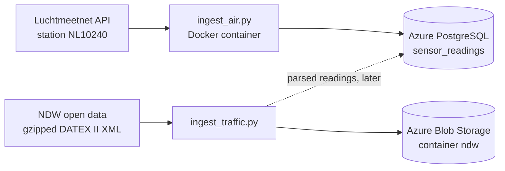

# AirBreda Architecture (Checkpoint 1)

```mermaid
flowchart LR
    A[Luchtmeetnet API<br/>station NL10240] --> B[ingest_air.py<br/>Docker container]
    C[NDW open data<br/>gzipped DATEX II XML] --> D[ingest_traffic.py]
    B --> E[(Azure PostgreSQL<br/>sensor_readings)]
    D --> F[(Azure Blob Storage<br/>container ndw)]
    D -. parsed readings, later .-> E
```

Region: France Central. Resource group: rg-airbreda.
