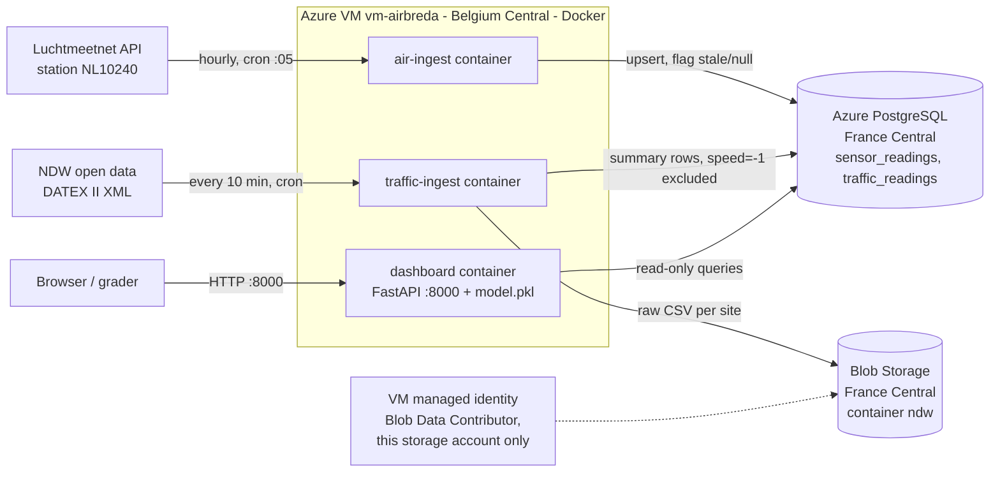

# AirBreda: Architecture Design Document

Author: Erfan Salour | Course: System Design & Cloud Platforms | Provider: Microsoft Azure

## 1. Architecture diagram (system as deployed)

Trust boundaries:
- Inbound: only SSH (22) and the dashboard (8000) are open on the VM network security group.
- The VM has a system-assigned managed identity with the role Storage Blob Data Contributor, scoped to one storage account. The ingestion code still uses a storage key from a `.env` file on the VM (see ADR-004, known limitation).
- The database accepts connections from any IP (lab setting) and requires a password and TLS.
- The Redis queue from Day 2 is NOT part of the deployment (see ADR-002).

## 2. ADR-001: Initial data storage strategy

**Context.** AirBreda ingests hourly NO2 readings from one Luchtmeetnet station (NL10240) and traffic counts from four NDW sites on the A27. The data has a fixed structure, needs time-range queries and a join between air quality and traffic. Volume is small: about 100,000 rows per year.

**Decision.** Parsed readings go into Azure Database for PostgreSQL (tables `sensor_readings` and `traffic_readings`). Raw NDW files go into Azure Blob Storage (container `ndw`). The primary key `(station_id, timestamp, component)` plus `INSERT ... ON CONFLICT` makes every write idempotent, so duplicates are harmless (at-least-once delivery with idempotent writes).

**Consequences.** Easier: indexed time-range queries, a simple join for the model, and re-running a script never creates duplicates. Harder: a relational database does not scale writes as far as DynamoDB or Cosmos DB, which we do not need at this size. The bucket keeps the original files, so if the parser has a bug or we want new features in six months, we can re-parse and retrain. Rejected: Cosmos DB (more expensive, weak at joins, scale we do not need).

## 3. ADR-002: Messaging architecture

**Context.** Day 2 asked us to decouple producers and consumers. Our ingestion scripts could publish readings to a broker, so later consumers (a model, an anomaly detector) would not touch the ingestion code.

**Decision.** We built the pattern with a Redis list called `readings` in Docker Compose: `air-ingest` and `traffic-ingest` publish JSON messages, and we checked 53 messages with `LRANGE`. Redis was chosen only because it runs as one container and teaches the pattern fast. In production we would use Azure Service Bus (a queue, about 0.10 euro per million operations) or Event Hubs for streaming. On the VM deployment we dropped the queue. Publishing is switched on only when `REDIS_HOST` is set, and if the broker is unreachable the script logs a `redis_unavailable` warning and still writes to the database, so no reading is lost.

**Consequences.** Without the queue there is one less service to run and monitor, which suits one VM, one hourly source and no second consumer. The cost is tight coupling: a new consumer needs a change in the ingestion code. The queue comes back when there is a second consumer of the readings or when ingestion outgrows one VM. On bad data: Luchtmeetnet values are flagged and kept (a gap in an hourly series hurts more than a flagged value), while NDW `speed = -1` is excluded from the stored speed (it is a "no measurement" marker, not a real number). If I started over I would keep the same split, because the two sources mean different things by "bad".

## 4. ADR-003: Resilience strategy

**Context.** AirBreda is an information dashboard, not a safety system. A short outage is annoying, not dangerous. We still need to notice when data stops or goes bad.

**Decision.**
- SLO for `/site/{id}`: 99.5% availability per month. That is 0.5% of about 730 hours = roughly 3.6 hours (about 219 minutes) of allowed downtime per month. The AWS December 2021 outage (about 5 hours) would use about 11% of a yearly budget (0.5% of 8,760 hours = 43.8 hours).
- DR tier: Backup & Restore. The database has automatic backups (7 days), the code is in Git, and the VM can be rebuilt from the Dockerfiles. Target recovery time about 1 hour, data loss up to the last backup.
- Logging: every container writes structured JSON (`fetch_success`, `DATA_QUALITY_ERROR`, `BAD_DATA_THRESHOLD_EXCEEDED`). `/health` shows the last successful fetch and the bad-data count per source for the last 24 hours. Because the ingestion containers run once and exit (cron), `/health` is built from what they wrote to the database, not from a per-container web server.
- Restarts: the dashboard uses `--restart unless-stopped`, cron survives reboots. We tested a VM restart: the dashboard came back by itself and cron kept its two lines.

**Consequences.** Backup & Restore is the cheapest tier. The next one, Pilot Light (a second small database in another region plus replication), would cost roughly 15 to 25 euro per month more `[CHECK]`, and would cut recovery time but not be needed for a public dashboard. Risks: a single VM and a single region mean one failure takes the dashboard down, and the restart test showed a gap of a few minutes with no traffic rows.

## 5. ADR-004: Compute strategy

**Context.** The ingestion has to run all day, not on a laptop. Load is tiny: a few HTTP calls per hour and one small web app.

**Decision.** One Azure VM (Ubuntu 24.04, `Standard_D2as_v4`, 2 vCPU, 8 GB) running Docker. Ingestion containers are started by cron (hourly for air, every 10 minutes for traffic, with the absolute path to docker). The VM is in Belgium Central because the student subscription policy only allows five regions, and B-series sizes had no capacity in France Central. The database and storage are in France Central.

**Consequences.** Full control and simple to explain (IaaS). Cost is about 70 euro per month if left running `[CHECK]`, which is high for the work done: a B-series VM would be about 8 to 15 euro. We would switch to Azure Container Apps or Azure Functions with a timer for ingestion if AirBreda grew to 50 corridors with a 5-minute interval. Unanticipated problems: regional capacity limits, Docker's old builder rejecting a `COPY` with several files and no trailing slash, and shell commands pasted into the wrong machine. Known limitations: the role assignment for the managed identity exists, but the ingestion code still uses a storage key from `.env` on the VM; the database firewall is open to all IPs; SSH is open to all IPs.

## 6. ADR-005: Compute and deployment strategy (extends ADR-004)

**Context.** Day 4 added a third container, the dashboard.

**Decision.** The dashboard runs as a long-lived container on the same VM (`docker run -d --restart unless-stopped`, port 8000). Testing with Docker Compose on my laptop first caught a missing package in the image and a path problem before they could break the VM. A small `deploy.sh` copies files and rebuilds on the VM in one command. This extends ADR-004: the compute choice did not change, only a third workload was added.

**Consequences.** One VM is still the right size at 10 corridors. At 50 corridors with 5-minute polling we would move to a managed container service, because a single VM cannot be patched or scaled without downtime. After a VM reboot all three come back: the dashboard because of the Docker restart policy, the two ingesters because cron runs at boot.

## 7. ADR-006: ML serving architecture

**Context.** We must predict NO2 from traffic with the data we collected ourselves. Traffic has no history in the NDW feed, so training rows only exist for hours after collection started.

**Decision.** A linear regression (`total_intensity_veh_per_hr`, `hour_of_day`) trained on [ROWS] joined hourly rows (R2 [R2], MAE [MAE] ug/m3, in-sample, because there are too few rows for a test set). Exceedance risk is a sigmoid of (predicted NO2 minus 40 ug/m3), steepness 0.2. The 40 value is the EU annual limit; it is an annual average and we predict hourly values, so it is only a reference. The model file is baked into the dashboard image and loaded by `predict.py`.

**Consequences.** With so little data a linear model is the correct amount of model; a random forest would just memorise a handful of points. The R2 and MAE say very little at this size. Training-serving skew: the model was trained on hourly mean traffic, so `/site/{id}` also uses the hourly mean (not the latest 10-minute snapshot), and the model file does not change between training and serving. Baking the model into the image means a retrain needs a rebuild and redeploy, which `deploy.sh` makes one command. One Luchtmeetnet station is enough because all four NDW sites are at the same interchange; a second interchange would need its own station. If `predict()` fails, `/site/{id}` still returns the real NO2 and intensity with the prediction fields set to null and logs an ERROR. Known limitation: NO2 is labelled by hour end and traffic by hour start, so the hours do not line up exactly.

## 8. Trade-off justifications

**Storage.** I considered a NoSQL store (Cosmos DB), object storage only, and PostgreSQL. I chose PostgreSQL for parsed data and Blob Storage for raw files. I gave up easy horizontal write scaling, which does not matter at about 100,000 rows per year, and I pay for a managed database (about 15 to 20 euro per month `[CHECK]`).

**Compute.** I considered a managed container service, Functions and a VM. I chose one VM for control and simplicity. I gave up cost efficiency (a D2as_v4 is far more than the load needs) and automatic scaling and patching.

**Messaging.** I considered a queue (Redis for the lab, Service Bus for production) and direct writes. I chose direct writes for the deployment. I gave up loose coupling, in exchange for one less thing to run.

**Disaster recovery.** I considered Pilot Light and Warm Standby, and chose Backup & Restore. I gave up fast recovery (about 1 hour instead of minutes) to save roughly 15 to 25 euro per month `[CHECK]` for an information-only dashboard.

## 9. Cloud provider rationale (for the Municipality of Breda)

We chose Microsoft Azure. Think of a cloud provider as renting space and equipment in a very secure data centre instead of buying and housing our own computers. Azure lets us rent exactly what we need, for exactly as long as we need it, and stop paying when we stop using it.

For a public body in the Netherlands, three things matter. First, location: we can choose data centres inside the European Union (for this project, in France and Belgium), so the data stays under European privacy rules. Second, many Dutch universities, schools and public organisations already use Microsoft for their accounts and tools, so staff can reuse the logins they already have, which lowers the risk of mistakes and the cost of training. Third, the services we need (a small database, file storage and a small server) are standard, well documented and have clear prices, so a different team could take over the system later.

What would we lose by switching? Mostly time and money, not capability. The main alternative, Amazon Web Services, offers nearly the same services. But moving means rebuilding the setup, retraining staff, and moving data, and the names and settings of every service differ. The data itself is stored in common formats (a standard database and plain CSV files), so we are not trapped: a move is possible, just not free. We also did not pick several providers at once, because that doubles the number of things to secure, monitor and pay for.

One honest note: this is a student project, so security settings are relaxed. Before real use, access to the database and the server would be limited to the municipality's own network, and passwords would be replaced by managed identities.

## 10. Cost estimate (West/France Central, euro per month) `[CHECK all numbers in the Azure pricing calculator]`

| Component | Current (1 corridor) | At 10 corridors | At 50 corridors |
|---|---|---|---|
| Compute (VM) | about 70 (D2as_v4) | about 70 (same VM) | about 250 (3-4 larger VMs or a managed container service) |
| Database | about 18 (B1ms + 32 GB) | about 30 (B2s) | about 120 (General Purpose, 2-4 vCores) |
| Object storage | under 1 | about 1 | about 3 |
| **Total** | **about 90** | **about 100** | **about 375** |

A single VM is still fine at 10 corridors (40 sites every 10 minutes is a light load). At 50 corridors with shorter intervals it is no longer the right choice: one VM becomes a single point of failure and we would move to managed containers (see ADR-005).

## 11. Reflection

**Least confident decision.** I am least confident about running everything on one oversized VM and about my dashboard's single prediction for all four sites. The VM is easy to explain, but it costs more than the work needs and is a single point of failure. To become confident I would measure real load and cost over a month, and compare it with Azure Container Apps for the same workload. For the model, I would need much more data to know whether total traffic is even a useful predictor, because weather, wind and background pollution probably matter more.

**More data.** My model was trained on [ROWS] hourly rows collected over about one day, so it only shows that the pipeline works. With a full year of readings I would change three things. Features: add wind speed, temperature, rain, weekday and holiday, lagged NO2 and lagged traffic, because NO2 depends on the weather and on the previous hours. Algorithm: try gradient boosting or a regularised model and compare it with a simple baseline ("same as the last hour"), which a linear model on traffic may not beat. Evaluation: use a time-based split (train on earlier months, test on later ones) with seasonal coverage, instead of in-sample scores, and report error by hour of day and by season. I would also calibrate the exceedance risk, or train a classifier on a binary exceedance label, so the score becomes a real probability.

**First thing to add.** Automated deployment and tests (CI/CD) plus Infrastructure as Code. Today I deploy with a shell script and I typed commands by hand, which already led to a command being run on the wrong machine. A pipeline that runs the tests, builds the images and deploys the same way every time would remove that risk, and Terraform would make the VM, database and network repeatable and reviewable. Right after that I would finish security: use the managed identity instead of the storage key, move secrets to Azure Key Vault, restrict the database firewall and SSH to known addresses, and add real alerting on the `BAD_DATA_THRESHOLD_EXCEEDED` log line.
